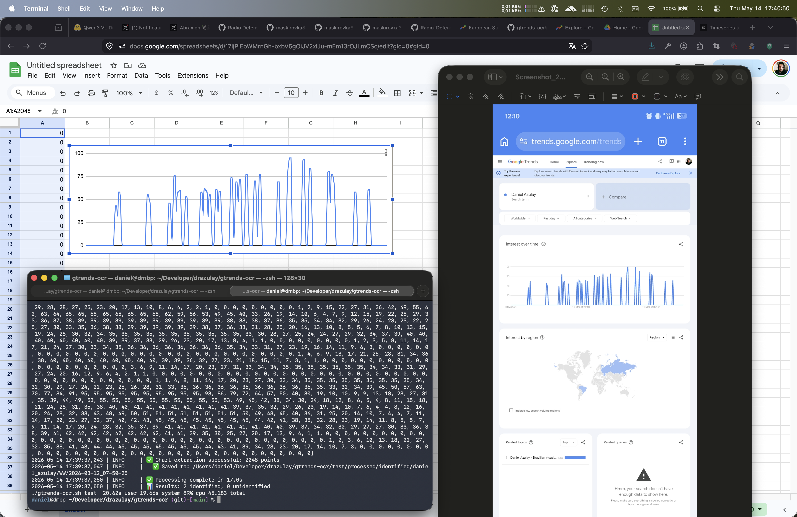

# GTRENDS-OCR - Google Trends Forensic Screenshot Organizer and Data Extraction Utility

## Description

Organizes Google Trends screenshots into a logical folder structure, then extracts the data from the charts and stores it with the organized images for later data analytics.

**This project was built to counter Google's censorship practices.**

## How It Works

This utility combines a lightweight Vision-Language Model (VLM) with a deterministic pixel-scanning algorithm to transform raw Google Trends screenshots into structured, analyzable time-series data. The pipeline is designed to be fully autonomous, robust against compression artifacts, and optimized for forensic data reconstruction.

### 1. Vision-Language Metadata Extraction
The first stage uses `Qwen/Qwen3-VL-2B-Instruct` to analyze the screenshot and extract structured context:
- **Strict JSON Output**: The model is prompted to return a clean JSON object containing `is_google_trends`, `search_terms`, `country`, and `date_range`.

- **Auto-Retry with Contextual Hints**: If the initial pass misses any field (e.g., country dropdown or timeframe), the system automatically re-prompts the model up to twice with targeted UI hints, merging successful outputs without overwriting already-correct data.

- **Filename Datetime Injection**: The exact timestamp parsed from the screenshot filename is injected directly into the JSON payload to preserve chain-of-custody timing.

### 2. Deterministic Chart Digitization (`chart_extract`)
Once metadata validation passes, the system delegates to a custom pixel-scanning module that bypasses traditional OCR and relies on geometric invariants:

- **16-Color Quantization**: The input image is first reduced to a 16-color palette via K-means clustering. This eliminates compression noise, anti-aliasing fringing, and device-specific color shifts.

- **Grid Line Detection**: The algorithm scans horizontally to identify exactly 5 equidistant gray lines. It validates the structural pattern (4 lighter grid lines + 1 darker baseline) and calculates the precise chart bounding box using probabilistic spacing checks (Coefficient of Variation < 0.25).

- **Column-by-Column Digitization**: Inside the cropped chart area, each vertical column is scanned. Non-grid, non-white pixels are grouped by dominant color, and their Y-positions are averaged to produce a clean set of trend points.

- **PCHIP Interpolation**: The extracted points are smoothed and stretched to exactly 2048 values using Piecewise Cubic Hermite Interpolating Polynomial interpolation. This guarantees monotonicity (no artificial overshoot/undershoot) while clamping all values to Google Trends' native 0.0–100.0 scale.

### 3. Algorithm Interaction & Output Structure
The VLM and pixel scanner operate in a cascading pipeline:

1. VLM validates the screenshot and extracts textual metadata.

2. If valid, the pixel scanner extracts the 2048-point time series.

3. Both datasets are merged into a single `metadata.json` file alongside the screenshot.

4. A companion `.txt` file provides a human-readable summary.

5. Files are automatically routed into a deterministic folder structure: `identified/[search_term]/[country_code]/[date_time]/`

### Reconstructing Hidden & Manipulated Trends
This tool was built specifically to counter data lifecycle manipulation, algorithmic suppression, and artificial amplification. Google Trends frequently:

- Prunes or hides historical relative search volume after events pass

- Artificially boosts or suppresses terms to shape narrative perception

- Fails to retain baseline data post-intervention (e.g., policy changes, PR campaigns, or coordinated campaigns)

By systematically capturing and digitizing screenshots over time, this utility allows you to:

- **Stitch fragmented historical data** into continuous, high-resolution time series

- **Detect censorship or amplification** by comparing native Google Trends outputs against your archived dataset

- **Analyze post-intervention responses** to reveal how search interest is artificially dampened or inflated after real-world events

- **Quantify true search volume trajectories** independent of platform-side filtering or dynamic scaling

### Screenshot Requirements & Optimization

- **Repeated Captures Required**: Because this tool reconstructs data from static images, consistent screenshot intervals are necessary to build a complete historical record.

- **Mobile-Optimized**: The detection algorithms are tuned for iOS/Android screenshots (including status bars, mobile UI scaling, and touch-optimized rendering).

- **Desktop Compatibility**: Desktop screenshots are currently untested, but if edge cases arise due to wider aspect ratios or desktop UI layouts, patches will be deployed promptly to maintain cross-platform reliability.

All extracted data remains local, offline-capable, and fully exportable for statistical analysis, visualization, or archival storage.

---

For all inquiries please email: maskirovka3301@gmail.com
